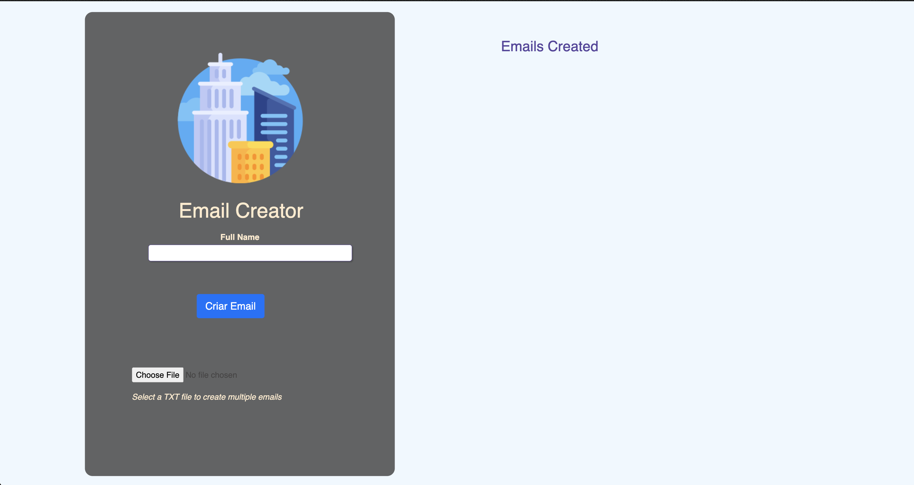
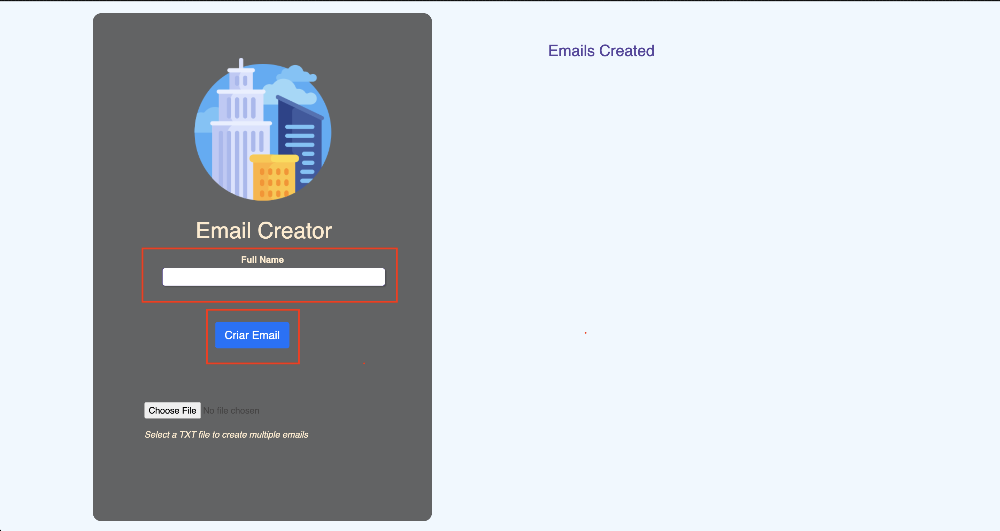
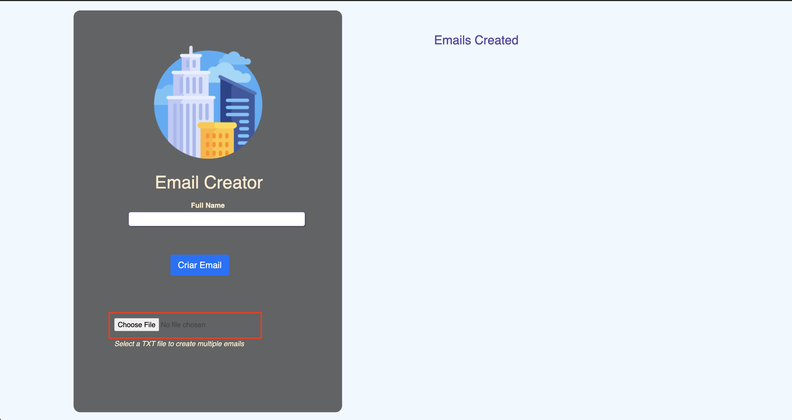

# Como utlizar o criador de emails: 💻

## Acesse o link: https://ninneee12.github.io/Testefronthosp/ ou faça download da pasta  Email_Creator e abra o arquivo index.html  
## Essa é a tela inicial da ferramenta
</img>
  
## Podemos gerar email de duas formas:
<ol>
  <li> colocando as informações manualmente</li>
  <li>Importando um arquivo no formato .TXT</li>
  </ol>
  
 ## Nota: Podemos utilizar os dois ao mesmo tempo para gerar emails.  
 ## Para utilizarmos o metodo de inserir manualmente, pode ser feito da seguinte forma:
 <ol>
    <li> No campo Full Name você deve inserir seu nome completo</li>
    <li> Clique no campo criar email para o sistema gerar um email a partir do seu nome completo e exbirá na tela do lado direito</li>  
  </ol>     
     </img>   
 Emails criados através da lista .TXT   
       </img>  
  
 ## Para utilizarmos o metodo de inserir enviando uma lista com a extensão TXT( bloco de notas) com os nomes completos, podera ser feito da seguinte forma:
 <ol>
    <li> Clique no choose file para que sua lista de nomes seja importada para o sistema e automaticamente os emails serão criados e exibidos no lado direito da    tela</li>
  </ol>
    
       </img>  
 Emails criados através da lista .TXT   
       </img>  
  
